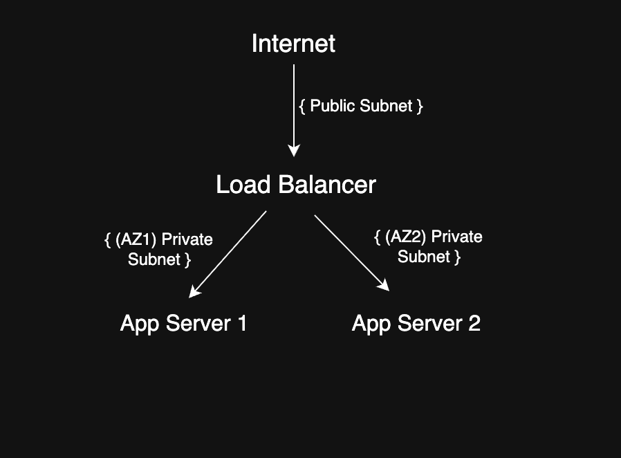

# Network Topology

## Overview
The architecture separates public and private resources and deploys application servers across multiple availability zones to improve security and reliability.

## Public Subnet
- Hosts the load balancer, which is the only internet-facing component  
- Connected to the Internet Gateway to receive external traffic  

## Private Subnets
- Contain application servers that handle business logic  
- Deployed across multiple availability zones for fault tolerance  
- Not directly accessible from the internet  

## Routing Logic
- Incoming traffic flows from the Internet to the Load Balancer  
- The Load Balancer distributes requests to application servers in different availability zones  
- Private subnets only accept traffic from the load balancer  

## Key Benefits
- **Security:** Internal servers are isolated from direct internet access  
- **High Availability:** Multi-AZ deployment ensures the system remains operational if one zone fails  
